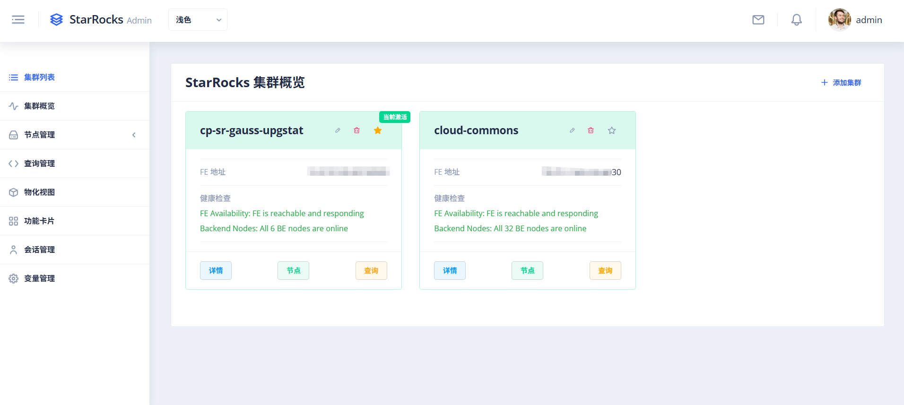

# StarRocks Admin

<div align="center">


**A modern, beautiful, and intelligent StarRocks cluster management platform**

[Features](#features) • [Quick Start](#quick-start) • [Deployment](#deployment) • [API Documentation](#api-documentation) • [Contributing](#contributing)

[中文版](#中文版) | [English](#english)

</div>

## Introduction

StarRocks Admin is a professional, enterprise-grade StarRocks database cluster management tool that provides an intuitive web interface for managing and monitoring multiple StarRocks clusters. Compared to StarRocks' native management interface, this platform offers richer functionality and a better user experience.

### Core Features

- **One-Click Deployment** - Supports traditional deployment, Docker, and Kubernetes
- **Real-time Monitoring** - View real-time cluster status and performance metrics
- **Cluster Management** - Unified management of multiple StarRocks clusters
- **Modern UI** - Modern interface based on Angular + Nebular
- **Security Authentication** - JWT authentication and permission management
- **Performance Analysis** - Query performance analysis and optimization suggestions

## Quick Start

### Method 1: One-Click Deployment (Recommended)

```bash
# 1. Clone the project
git clone https://github.com/jlon/starrocks-admin.git
cd starrocks-admin

# 2. Build and package
make build

# 3. Start the service
cd build/dist
./bin/starrocks-admin.sh start

# 4. Access the application
open http://localhost:8080
```

### Method 2: Docker Deployment (Recommended)

```bash
# Option 1: Use pre-built image from Docker Hub
docker pull ghcr.io/jlon/starrocks-admin:latest
docker run -d -p 8080:8080 --name starrocks-admin \
  -v $(pwd)/data:/app/data \
  -v $(pwd)/logs:/app/logs \
  ghcr.io/jlon/starrocks-admin:latest

# Option 2: Build from source
git clone https://github.com/jlon/starrocks-admin.git
cd starrocks-admin
make docker-build  # Build Docker image
make docker-up     # Start Docker container

# Access the application
open http://localhost:8080
```

## Interface Preview

StarRocks Admin provides an intuitive and beautiful web management interface covering all aspects of cluster management.

### Cluster Management

Unified management of multiple StarRocks clusters with support for adding, editing, and deleting cluster configurations.

### Cluster Overview

Real-time display of overall cluster status, performance metrics, and resource usage for a comprehensive view of cluster health.


Detailed cluster metrics and performance indicators.


Resource usage and capacity planning insights.

### Node Management - FE Nodes

View and manage Frontend (FE) nodes, monitoring their running status and resource usage.

### Node Management - BE Nodes

View and manage Backend (BE) nodes with detailed performance metrics.

### Query Management - Real-time Queries

Real-time view of executing queries with support for query termination and performance analysis.


Monitor actively running queries and their execution status.

### Query Management - Audit Logs

Comprehensive audit logs for all executed queries with detailed metadata.

### Query Management - Query Profiles

Detailed query execution profiles for performance analysis and optimization.


In-depth query performance metrics and execution plans.

### Materialized Views

View and manage all materialized views in the cluster, with support for enabling, disabling, and editing.


Detailed materialized view configuration and refresh status.

### Feature Cards

Quick access to system functions with support for custom SQL execution and common operations.

### Session Management

Manage database connection sessions, view active sessions and historical connection information.

### Variable Management

Configure and manage system variables with support for viewing and modifying runtime parameters.

### System Management - User Management

Manage system users, roles, and permissions with fine-grained access control.

### System Management - Organization Management

Multi-tenant organization management for enterprise deployments.

### System Management - Role Management

Define and manage user roles with customizable permission sets.

## Configuration

### StarRocks User Permissions (Important)

**Before adding a cluster**, you need to create a dedicated monitoring user with appropriate read-only permissions in StarRocks.

```bash
# Execute the permission setup script
cd scripts
mysql -h <fe_host> -P 9030 -u root -p < setup_starrocks_admin_role.sql

# Verify permissions
mysql -h <fe_host> -P 9030 -u starrocks_monitor -p < verify_permissions.sql
```

For detailed permission configuration guide, see [scripts/README_PERMISSIONS.md](scripts/README_PERMISSIONS.md)

**Security Note:** Do NOT use the `root` account in production. Always create a dedicated monitoring user with minimal required permissions.

### Main Configuration File (conf/config.toml)

```toml
[server]
host = "0.0.0.0"
port = 8080

[database]
url = "sqlite://data/starrocks-admin.db"

[auth]
jwt_secret = "your-secret-key-change-in-production"
jwt_expires_in = "24h"

[logging]
level = "info,starrocks_admin_backend=debug"
file = "logs/starrocks-admin.log"

[static_config]
enabled = true
web_root = "web"

# Metrics collector configuration
[metrics]
interval_secs = "30s"   
retention_days = "7d"  
enabled = true          
```

## Contributing

We welcome all forms of contributions! Please follow these steps:

1. **Fork the project**
2. **Create a feature branch** (`git checkout -b feature/AmazingFeature`)
3. **Commit your changes** (`git commit -m 'Add some AmazingFeature'`)
4. **Push to the branch** (`git push origin feature/AmazingFeature`)
5. **Create a Pull Request**

## License

This project is licensed under the Apache License 2.0 - see the [LICENSE](LICENSE) file for details.

## Acknowledgments

- [ngx-admin](https://github.com/John/ngx-admin) - Excellent Angular admin template
- [Nebular](https://John.github.io/nebular/) - Beautiful UI component library
- [Axum](https://github.com/tokio-rs/axum) - Powerful Rust web framework
- [StarRocks](https://www.starrocks.io/) - High-performance analytical database
---
[↑ Back to Top](#starrocks-admin)
---

# 中文版

<div align="center">

**一个现代化、美观、智能的 StarRocks 集群管理平台**

[功能特性](#功能特性) • [快速开始](#快速开始) • [部署指南](#部署指南) • [API 文档](#api-文档) • [贡献](#贡献)

[English](#english) | [中文版](#中文版)

</div>

## 简介

StarRocks Admin 是一个专业的、企业级的 StarRocks 数据库集群管理工具，提供直观的 Web 界面来管理和监控多个 StarRocks 集群。相比 StarRocks 原生的管理界面，本平台提供了更丰富的功能和更好的用户体验。

### 核心特性

- **一键部署** - 支持传统部署、Docker 和 Kubernetes
- **实时监控** - 查看集群的实时状态和性能指标
- **集群管理** - 统一管理多个 StarRocks 集群
- **现代 UI** - 基于 Angular + Nebular 的现代化界面
- **安全认证** - JWT 认证和权限管理
- **性能分析** - 查询性能分析和优化建议

## 快速开始

### 方式一：一键部署（推荐）

```bash
# 1. 克隆项目
git clone https://github.com/jlon/starrocks-admin.git
cd starrocks-admin

# 2. 构建和打包
make build

# 3. 启动服务
cd build/dist
./bin/starrocks-admin.sh start

# 4. 访问应用
open http://localhost:8080
```

### 方式二：Docker 部署（推荐）

```bash
# 方式1: 使用 Docker Hub 预构建镜像
docker pull ghcr.io/jlon/starrocks-admin:latest
docker run -d -p 8080:8080 --name starrocks-admin \
  -v $(pwd)/data:/app/data \
  -v $(pwd)/logs:/app/logs \
  ghcr.io/jlon/starrocks-admin:latest

# 方式2: 从源码构建
git clone https://github.com/jlon/starrocks-admin.git
cd starrocks-admin
make docker-build  # 构建 Docker 镜像
make docker-up     # 启动 Docker 容器

# 访问应用
open http://localhost:8080
```

## 界面预览

StarRocks Admin 提供了直观、美观的 Web 管理界面，涵盖集群管理的各个方面。

### 集群管理

统一管理多个 StarRocks 集群，支持添加、编辑、删除集群配置。

### 集群概览

实时展示集群整体状态、性能指标和资源使用情况，一目了然掌握集群健康状态。


详细的集群指标和性能监控数据。


资源使用情况和容量规划建议。

### 节点管理 - FE 节点

查看和管理前端（FE）节点，监控节点运行状态和资源使用。

### 节点管理 - BE 节点

查看和管理后端（BE）节点，包含详细的性能指标。

### 查询管理 - 实时查询

实时查看正在执行的查询，支持查询终止和性能分析。


监控活跃查询及其执行状态。

### 查询管理 - 审计日志

完整的查询审计日志，包含详细的元数据信息。

### 查询管理 - Query Profile

详细的查询执行Profile，用于性能分析和优化。


深入的查询性能指标和执行计划。

### 物化视图

查看和管理集群中的所有物化视图，支持开启、关闭、编辑等操作。


详细的物化视图配置和刷新状态。

### 功能卡片

快速访问系统功能，支持自定义SQL执行和常用操作。

### 会话管理

管理数据库连接会话，查看活跃会话和历史连接信息。

### 变量管理

配置和管理系统变量，支持查看和修改运行时参数。

### 系统管理 - 用户管理

管理系统用户、角色和权限，实现细粒度的访问控制。

### 系统管理 - 组织管理

多租户组织管理，适用于企业级部署场景。

### 系统管理 - 角色管理

定义和管理用户角色，配置可自定义的权限集。

## 配置说明

### StarRocks 用户权限配置(重要)

**在添加集群之前**,需要在 StarRocks 中创建专用的监控用户并授予适当的只读权限。

```bash
# 执行权限配置脚本
cd scripts
mysql -h <fe_host> -P 9030 -u root -p < setup_starrocks_admin_role.sql

# 验证权限配置
mysql -h <fe_host> -P 9030 -u starrocks_monitor -p < verify_permissions.sql
```

详细的权限配置指南请参考 [scripts/README_PERMISSIONS.md](scripts/README_PERMISSIONS.md)

**安全提示:** 生产环境禁止使用 `root` 账号，务必创建专用的监控账号并遵循最小权限原则。

### 主配置文件 (conf/config.toml)

```toml
[server]
host = "0.0.0.0"
port = 8080

[database]
url = "sqlite://data/starrocks-admin.db"

[auth]
jwt_secret = "your-secret-key-change-in-production"
jwt_expires_in = "24h"

[logging]
level = "info,starrocks_admin_backend=debug"
file = "logs/starrocks-admin.log"

[static_config]
enabled = true
web_root = "web"

# Metrics collector configuration
# 支持人类可读格式："30s"、"5m"、"1h"；保留期支持："7d"、"2w"
[metrics]
interval_secs = "30s"    # 采集间隔，默认30秒
retention_days = "7d"    # 数据保留时长，默认7天
enabled = true            # 是否启用采集
```

- 环境变量覆盖示例：
```
APP_METRICS_INTERVAL_SECS=1m \
APP_METRICS_RETENTION_DAYS=14d \
APP_METRICS_ENABLED=true \
```

## 贡献

我们欢迎所有形式的贡献！请遵循以下步骤：

1. **Fork 项目**
2. **创建特性分支** (`git checkout -b feature/AmazingFeature`)
3. **提交更改** (`git commit -m 'Add some AmazingFeature'`)
4. **推送分支** (`git push origin feature/AmazingFeature`)
5. **创建 Pull Request**

## 许可证

本项目采用 Apache License 2.0 许可证 - 查看 [LICENSE](LICENSE) 文件了解详情。

## 致谢

- [ngx-admin](https://github.com/John/ngx-admin) - 优秀的 Angular 管理模板
- [Nebular](https://John.github.io/nebular/) - 漂亮的 UI 组件库
- [Axum](https://github.com/tokio-rs/axum) - 强大的 Rust Web 框架
- [StarRocks](https://www.starrocks.io/) - 高性能分析数据库

## 捐赠支持

<div align="center">


**您的捐赠将帮助我持续开源更新，非常感谢。**

---

**Made with ❤️ for StarRocks Community**

[↑ 回到顶部](#starrocks-admin)

</div>