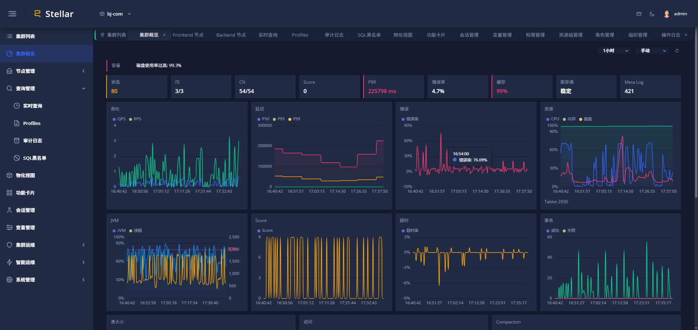
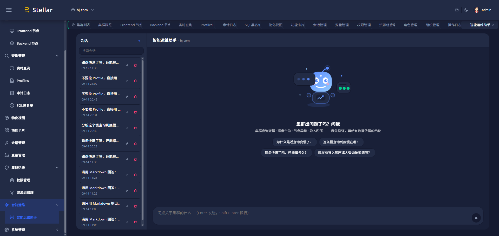
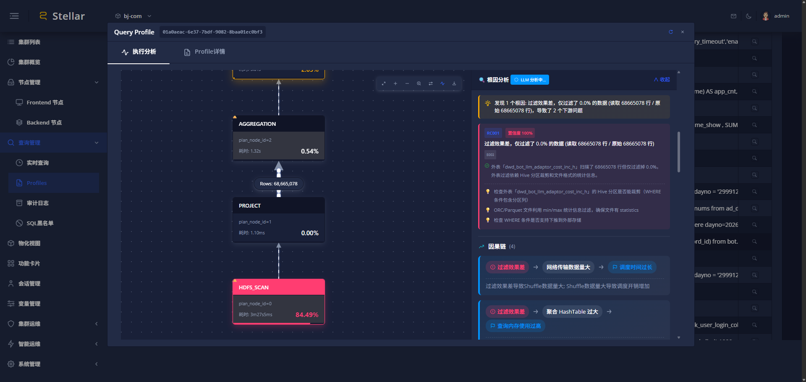
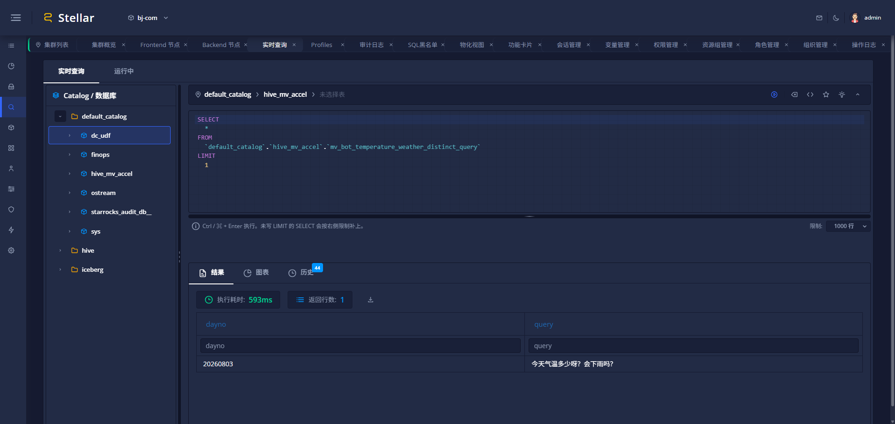
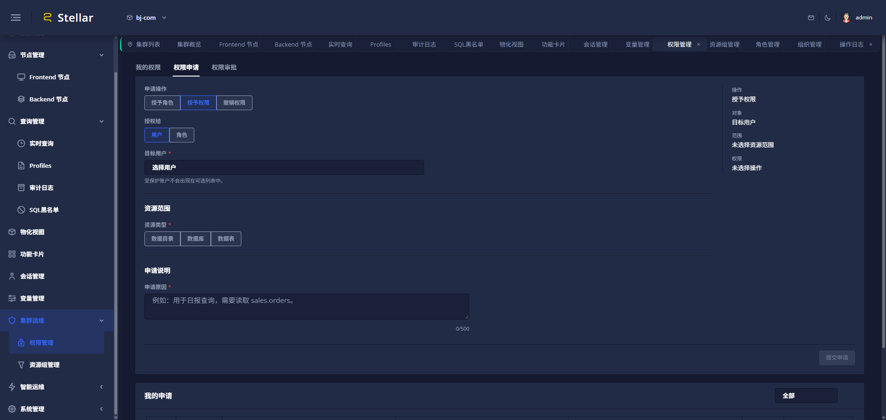

# Stellar

[English](README.md) | [简体中文](README.zh-CN.md)

> An operations control plane for StarRocks and Apache Doris OLAP clusters.

<p align="center">
  <a href="https://www.xclaw.live/stellar/"><strong>Download the latest Stellar release</strong></a><br>
  <sub>Get the current package first. Source code and build instructions are below.</sub>
</p>

[Download latest](https://www.xclaw.live/stellar/) · [View source code](https://github.com/jlon/starrocks-admin) · [License](LICENSE)

<p align="center">
  
</p>

## What It Does

| Capability | Description |
| --- | --- |
| Multi-cluster operations | Manage StarRocks and Doris clusters from one console. Inspect FE and BE/CN node health, resource metrics, and trends. |
| Query diagnostics | Investigate live queries, run SQL, inspect audit logs, and visualize Query Profiles to locate execution bottlenecks. |
| Controlled AI operations | Gather evidence from cluster data, diagnose incidents, and propose actions that require human confirmation. |
| Security and governance | Manage organizations, users, roles, resource groups, permission requests, and operational audit records. |

## Screenshots

<table>
  <tr>
    <td width="50%"><br><b>Operations Assistant</b><br>Answers questions from cluster evidence and produces auditable recommendations and controlled actions.</td>
    <td width="50%"><br><b>Query Profile Diagnostics</b><br>Locates bottlenecks in the execution DAG and presents root-cause paths with optimization recommendations.</td>
  </tr>
  <tr>
    <td width="50%"><br><b>SQL Workspace</b><br>Browse catalogs, run SQL, and inspect results, charts, and execution history.</td>
    <td width="50%"><br><b>Permissions and Audit</b><br>Manage access by organization and role, and retain records of important operations.</td>
  </tr>
</table>

## Run With Docker

The latest release is available from the [download page](https://www.xclaw.live/stellar/). Docker is also supported for a quick evaluation. The first startup generates a one-time password for `admin`; change it after signing in.

```bash
docker run -d \
  --name stellar \
  --restart unless-stopped \
  -p 9527:9527 \
  -v "$(pwd)/stellar-data:/data" \
  ghcr.io/jlon/stellar:latest

docker logs stellar 2>&1 | grep 'password:'
```

Open `http://localhost:9527` and sign in with `admin` and the one-time password from the logs.

## Source Code

Browse the code, report issues, and contribute at [jlon/starrocks-admin](https://github.com/jlon/starrocks-admin). To build it locally:

```bash
git clone https://github.com/jlon/starrocks-admin.git
cd starrocks-admin
make build
```

The project uses Rust with Axum and SQLx on the backend, and Angular with Nebular and ECharts on the frontend.

## License

Stellar is released under the [Apache License 2.0](LICENSE).

## Support Stellar

<p align="center">
  <br>
  <sub>Donations help sustain Stellar's open-source maintenance.</sub>
</p>
