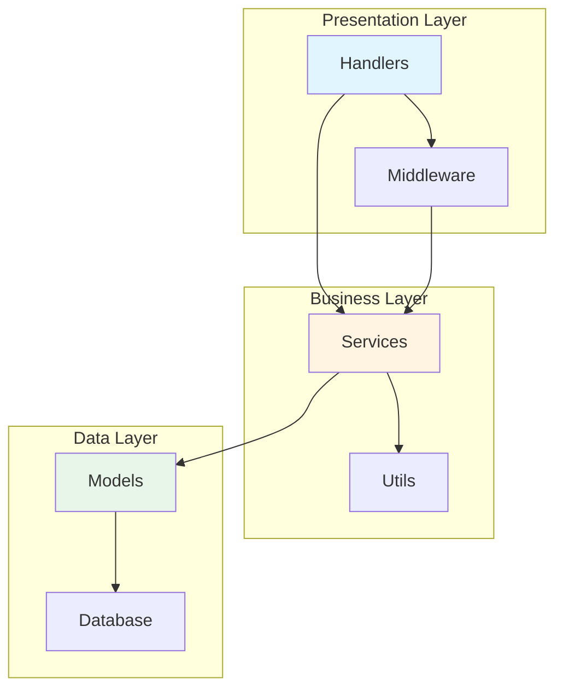

# StarRocks Admin 后端代码审查报告

**审查日期**: 2024-11-26  
**审查人**: Rust 高级开发专家  
**项目**: StarRocks Admin Backend  
**语言**: Rust  
**框架**: Axum + SQLx + Casbin

---

## 📋 执行摘要

### 总体评分: ⭐⭐⭐⭐ (4/5)

本项目整体架构清晰，代码质量较高，遵循了 Rust 社区最佳实践。主要优势包括:
- 清晰的分层架构 (Handlers → Services → Models)
- 良好的错误处理机制
- 完善的日志系统
- 合理的依赖注入设计

仍有改进空间的领域:
- 部分代码存在重复逻辑
- 配置管理可以更简洁
- 缺少单元测试覆盖
- 密码存储未加密(TODO标记)

---

## 🎯 核心编程原则审查

### 1. KISS (Keep It Simple, Stupid) - ⭐⭐⭐⭐

**优点**:
- `AppState` 设计简洁明了，直接使用 Arc 包装服务，避免过度抽象
- 错误类型 `ApiError` 使用 thiserror 简化错误处理
- JWT 工具类实现简单实用

**改进建议**:
```rust
// ❌ 配置解析过于复杂 (config.rs: 400+ 行)
// 建议: 将配置验证、CLI解析、环境变量处理拆分成独立模块

// 当前 config.rs 包含:
- Config 结构定义
- CLI 参数解析
- 环境变量覆盖
- TOML 解析
- 自定义反序列化器
- 验证逻辑

// 建议重构为:
src/config/
  ├── mod.rs          // Config 核心定义
  ├── cli.rs          // CLI 参数处理
  ├── env.rs          // 环境变量处理
  ├── validation.rs   // 验证逻辑
  └── deserializers.rs // 自定义反序列化
```

### 2. YAGNI (You Aren't Gonna Need It) - ⭐⭐⭐

**需要审视的过度设计**:

```rust
// middleware/permission_extractor.rs - 316 行复杂的权限提取逻辑
// 问题: 使用了函数指针、闭包、多层嵌套的模式匹配
// 建议: 考虑使用声明式的路由权限映射表

// 当前实现:
let handlers: Vec<RouteHandler> = vec![
    Box::new(|seg, m| { /* complex logic */ }),
    Box::new(extract_materialized_views_action),
    // ...
];

// 建议: 使用静态映射表
static ROUTE_PERMISSIONS: &[(&str, &str, &str)] = &[
    ("DELETE", "/api/clusters/backends/:host/:port", "backends:delete"),
    ("DELETE", "/api/clusters/queries/:id", "queries:kill"),
    // ...
];
```

### 3. DRY (Don't Repeat Yourself) - ⭐⭐⭐

**发现的重复代码**:

#### 问题 1: 数据库查询重复

```rust
// auth_service.rs, user_service.rs 等多处重复
// ❌ 重复的用户查询逻辑
let user: Option<User> = sqlx::query_as("SELECT * FROM users WHERE id = ?")
    .bind(user_id)
    .fetch_optional(&self.pool)
    .await?;

// ✅ 建议: 提取到 UserRepository
pub struct UserRepository {
    pool: SqlitePool,
}

impl UserRepository {
    pub async fn find_by_id(&self, id: i64) -> ApiResult<Option<User>> {
        sqlx::query_as("SELECT * FROM users WHERE id = ?")
            .bind(id)
            .fetch_optional(&self.pool)
            .await
            .map_err(Into::into)
    }
}
```

#### 问题 2: 日志记录重复

```rust
// 多个 handler 中重复的日志模式
tracing::info!("User registered successfully: {} (ID: {})", user.username, user.id);
tracing::debug!("Registration request: username={}, email={:?}", req.username, req.email);

// ✅ 建议: 使用宏简化
use crate::utils::macros::log_operation;

log_operation!(info, "user_registered", user_id = user.id, username = user.username);
```

### 4. SOLID 原则 - ⭐⭐⭐⭐

#### S - 单一职责原则 ✅

**良好实践**:
```rust
// ClusterService 只负责集群管理
// AuthService 只负责认证
// MySQLPoolManager 只负责连接池管理
```

#### O - 开闭原则 ⚠️

**改进建议**:
```rust
// ❌ permission_extractor.rs 添加新路由需要修改现有代码

// ✅ 建议: 使用 trait 实现可扩展的权限提取器
pub trait PermissionExtractor {
    fn can_extract(&self, method: &str, uri: &str) -> bool;
    fn extract(&self, method: &str, uri: &str) -> Option<(String, String)>;
}

pub struct ExtractorRegistry {
    extractors: Vec<Box<dyn PermissionExtractor>>,
}
```

#### L - 里氏替换原则 ✅

**符合原则**: 使用 Arc 和 trait objects 保证了可替换性

#### I - 接口隔离原则 ✅

**良好设计**: 各 Service 接口职责清晰，没有胖接口

#### D - 依赖倒置原则 ⚠️

**改进空间**:
```rust
// ❌ Service 直接依赖具体实现
pub struct ClusterService {
    pool: SqlitePool,  // 直接依赖 SQLx
    mysql_pool_manager: Arc<MySQLPoolManager>,
}

// ✅ 建议: 使用 trait 抽象数据访问
#[async_trait]
pub trait ClusterRepository {
    async fn create(&self, cluster: CreateClusterRequest) -> ApiResult<Cluster>;
    async fn find_by_id(&self, id: i64) -> ApiResult<Option<Cluster>>;
}

pub struct ClusterService<R: ClusterRepository> {
    repository: R,
    mysql_pool_manager: Arc<MySQLPoolManager>,
}
```

---

## 🏗️ 架构设计审查

### 架构图



### 优点

1. **清晰的分层**: Handlers → Services → Models 三层架构
2. **良好的关注点分离**: 中间件、服务、模型各司其职
3. **依赖注入**: 使用 AppState 统一管理依赖

### 改进建议

#### 1. 引入 Repository 层

```rust
// 当前: Service 直接操作数据库
// 建议: 添加 Repository 层抽象数据访问

src/
  ├── handlers/
  ├── services/
  ├── repositories/  // 新增
  │   ├── cluster_repository.rs
  │   ├── user_repository.rs
  │   └── mod.rs
  ├── models/
  └── db/
```

#### 2. 统一错误处理策略

```rust
// 建议在 Service 层统一使用 Result<T, ApiError>
// 避免在 handler 层再次转换错误

// ✅ 当前做法正确
pub async fn create_cluster(&self, req: CreateClusterRequest) -> ApiResult<Cluster>

// 保持这种一致性
```

---

## 🔒 安全性审查

### 严重问题 ⚠️

#### 1. 密码未加密存储

```rust
// ❌ cluster_service.rs:90
.bind(&req.password) // TODO: Encrypt in production

// ✅ 必须修复: 使用加密存储敏感信息
use aes_gcm::{Aes256Gcm, Key, Nonce};

pub struct PasswordEncryptor {
    cipher: Aes256Gcm,
}

impl PasswordEncryptor {
    pub fn encrypt(&self, password: &str) -> ApiResult<String> {
        // 实现 AES-256-GCM 加密
    }
    
    pub fn decrypt(&self, encrypted: &str) -> ApiResult<String> {
        // 实现解密
    }
}
```

#### 2. JWT 密钥配置警告

```rust
// ✅ 已有警告机制 (config.rs:311-317)
if self.auth.jwt_secret == "dev-secret-key-change-in-production" {
    tracing::warn!("⚠️  WARNING: Using default JWT secret!");
}

// 建议: 在生产环境强制要求设置，而非仅警告
if cfg!(not(debug_assertions)) && self.auth.jwt_secret == "dev-secret-key-change-in-production" {
    anyhow::bail!("Production environment must set custom JWT secret");
}
```

### 中等风险

#### SQL 注入防护 ✅

```rust
// ✅ 使用参数化查询，防止 SQL 注入
sqlx::query_as("SELECT * FROM users WHERE username = ?")
    .bind(&req.username)
    .fetch_optional(&self.pool)
```

#### CORS 配置 ⚠️

```rust
// ❌ main.rs:616 - 过于宽松的 CORS 配置
.layer(tower_http::cors::CorsLayer::permissive());

// ✅ 建议: 生产环境限制 CORS
let cors = if cfg!(debug_assertions) {
    CorsLayer::permissive()
} else {
    CorsLayer::new()
        .allow_origin(config.server.allowed_origins.parse::<HeaderValue>()?)
        .allow_methods([Method::GET, Method::POST, Method::PUT, Method::DELETE])
        .allow_headers([AUTHORIZATION, CONTENT_TYPE])
};
```

---

## 📊 代码质量审查

### 1. 错误处理 - ⭐⭐⭐⭐⭐

**优秀实践**:

```rust
// ✅ 使用 thiserror 定义清晰的错误类型
#[derive(Error, Debug)]
pub enum ApiError {
    #[error("Unauthorized: {0}")]
    Unauthorized(String),
    
    #[error("Cluster {cluster_id} not found")]
    ClusterNotFound { cluster_id: i64 },
    
    #[error(transparent)]
    Other(#[from] anyhow::Error),
}

// ✅ 错误码分类合理 (1xxx=认证, 2xxx=集群, 3xxx=资源)
pub fn error_code(&self) -> i32 {
    match self {
        Self::Unauthorized(_) => 1001,
        Self::ClusterNotFound { .. } => 2001,
        // ...
    }
}
```

### 2. 日志记录 - ⭐⭐⭐⭐

**优点**:
- 使用 tracing 框架，支持结构化日志
- 日志级别使用合理 (debug/info/warn/error)
- 关键操作有日志记录

**改进建议**:

```rust
// ❌ 当前: 部分重复日志
tracing::info!("User registered successfully: {} (ID: {})", user.username, user.id);
tracing::info!("User logged in successfully: {} (ID: {})", user.username, user.id);

// ✅ 建议: 使用结构化日志
tracing::info!(
    event = "user_registered",
    user_id = user.id,
    username = %user.username,
    "User registration completed"
);
```

### 3. 性能优化 - ⭐⭐⭐⭐

**优秀设计**:

```rust
// ✅ 使用 DashMap 替代 RwLock<HashMap>
// MySQLPoolManager 注释: "3-5x better than RwLock<HashMap> under high concurrency"
pub struct MySQLPoolManager {
    pools: Arc<DashMap<i64, Pool>>,
}

// ✅ 连接池配置合理
.with_constraints(mysql_async::PoolConstraints::new(2, 20)
.with_inactive_connection_ttl(std::time::Duration::from_secs(300))
```

**潜在问题**:

```rust
// ⚠️ middleware/auth.rs:156-173 
// 在中间件中使用 block_on 可能影响性能
fn async_std_block_on_fetch_org(db: &SqlitePool, user_id: i64) -> Option<i64> {
    let rt = tokio::runtime::Handle::try_current();
    if let Ok(handle) = rt {
        return handle.block_on(async move { /* ... */ });
    }
}

// ✅ 建议: 重构为异步流程或缓存
// 1. 合并到主查询中 (SQL JOIN)
// 2. 使用 Redis 缓存用户组织关系
```

### 4. 代码复杂度 - ⭐⭐⭐

**高复杂度模块**:

1. **permission_extractor.rs** (316 行)
   - 圈复杂度: ~25
   - 建议: 使用配置驱动的权限映射

2. **config.rs** (512 行)
   - 职责过多: 配置、CLI、环境变量、验证
   - 建议: 拆分模块

3. **overview_service.rs** (1878 行)
   - 建议: 拆分为多个子服务

---

## 🧪 测试覆盖率审查

### 当前状态 ⚠️

```rust
// ✅ JWT 工具类有单元测试
#[cfg(test)]
mod tests {
    #[test]
    fn test_jwt_generation_and_verification() { }
}

// ❌ 缺少:
// - Service 层单元测试
// - Handler 集成测试
// - 边界情况测试
```

### 建议测试结构

```rust
// 添加测试模块
#[cfg(test)]
mod tests {
    use super::*;
    
    #[tokio::test]
    async fn test_create_cluster_success() {
        // Arrange
        let service = setup_test_service().await;
        
        // Act
        let result = service.create_cluster(valid_request()).await;
        
        // Assert
        assert!(result.is_ok());
    }
    
    #[tokio::test]
    async fn test_create_cluster_duplicate_name() {
        // 测试重复名称场景
    }
}
```

### 建议添加的测试

```rust
tests/
  ├── integration/
  │   ├── auth_tests.rs      // 认证流程测试
  │   ├── cluster_tests.rs   // 集群管理测试
  │   └── rbac_tests.rs      // 权限测试
  ├── unit/
  │   ├── services/
  │   ├── utils/
  │   └── middleware/
  └── fixtures/
      ├── test_data.sql
      └── mock_responses.json
```

---

## 📝 代码风格审查

### Rustfmt 配置 ✅

```toml
// rustfmt.toml - 配置合理
max_width = 100
hard_tabs = false
tab_spaces = 4
reorder_imports = true
```

### 命名规范 ✅

```rust
// ✅ 遵循 Rust 命名规范
- 结构体: PascalCase (AppState, ClusterService)
- 函数: snake_case (create_cluster, get_user_by_id)
- 常量: SCREAMING_SNAKE_CASE (DEFAULT_COST)
- 模块: snake_case (auth_service, mysql_pool_manager)
```

### 文档注释 ⚠️

```rust
// ❌ 缺少公共 API 文档
pub struct MySQLPoolManager {
    pools: Arc<DashMap<i64, Pool>>,
}

// ✅ 建议添加文档
/// MySQL connection pool manager for StarRocks clusters
///
/// # Design
/// Uses DashMap for lock-free concurrent access to cluster connection pools.
///
/// # Performance
/// 3-5x better than RwLock<HashMap> under high concurrency.
///
/// # Examples
/// ```
/// let manager = MySQLPoolManager::new();
/// let pool = manager.get_pool(&cluster).await?;
/// ```
pub struct MySQLPoolManager {
    pools: Arc<DashMap<i64, Pool>>,
}
```

---

## 🚀 性能优化建议

### 1. 数据库查询优化

```rust
// ⚠️ N+1 查询问题
// auth_service.rs 多次查询判断角色
let is_super_admin = self.is_user_super_admin(user.id).await?;
let is_org_admin = self.is_user_org_admin(user.id).await?;

// ✅ 优化: 单次查询获取所有角色
SELECT 
    COALESCE(MAX(CASE WHEN r.code = 'super_admin' THEN 1 ELSE 0 END), 0) as is_super_admin,
    COALESCE(MAX(CASE WHEN r.code LIKE 'org_admin_%' THEN 1 ELSE 0 END), 0) as is_org_admin
FROM user_roles ur
JOIN roles r ON ur.role_id = r.id
WHERE ur.user_id = ?
```

### 2. 缓存策略

```rust
// 建议添加缓存层
use once_cell::sync::Lazy;
use dashmap::DashMap;

static USER_ROLE_CACHE: Lazy<DashMap<i64, Vec<String>>> = Lazy::new(DashMap::new);

pub async fn get_user_roles_cached(&self, user_id: i64) -> ApiResult<Vec<String>> {
    if let Some(roles) = USER_ROLE_CACHE.get(&user_id) {
        return Ok(roles.clone());
    }
    
    let roles = self.fetch_user_roles(user_id).await?;
    USER_ROLE_CACHE.insert(user_id, roles.clone());
    Ok(roles)
}
```

### 3. 批量操作优化

```rust
// 建议: 支持批量操作减少数据库往返
pub async fn create_clusters_batch(
    &self, 
    requests: Vec<CreateClusterRequest>
) -> ApiResult<Vec<Cluster>> {
    // 使用事务批量插入
}
```

---

## 🔧 具体改进建议

### 优先级 P0 (必须修复)

1. **密码加密** (cluster_service.rs:90)
   ```rust
   // 添加加密依赖
   [dependencies]
   aes-gcm = "0.10"
   base64 = "0.21"
   
   // 实现加密存储
   pub struct SecretManager {
       cipher: Aes256Gcm,
   }
   ```

2. **生产环境 CORS 限制** (main.rs:616)
   ```rust
   let cors = if cfg!(debug_assertions) {
       CorsLayer::permissive()
   } else {
       CorsLayer::new()
           .allow_origin(allowed_origins)
           .allow_methods(allowed_methods)
   };
   ```

### 优先级 P1 (强烈建议)

1. **添加单元测试覆盖**
   - 目标: 核心服务 >80% 覆盖率
   - 重点: AuthService, ClusterService, CasbinService

2. **拆分大文件**
   - config.rs (512 行) → 拆分为多个模块
   - permission_extractor.rs (316 行) → 使用配置驱动
   - overview_service.rs (1878 行) → 拆分子服务

3. **添加 API 文档**
   ```rust
   /// Create a new cluster
   ///
   /// # Arguments
   /// * `req` - Cluster creation request
   ///
   /// # Returns
   /// Created cluster or error
   ///
   /// # Errors
   /// - `ValidationError` if cluster name exists
   /// - `DatabaseError` if insert fails
   pub async fn create_cluster(...) -> ApiResult<Cluster>
   ```

### 优先级 P2 (可选优化)

1. **引入 Repository 模式**
2. **添加性能监控**
3. **实现请求限流**
4. **添加健康检查端点详细信息**

---

## 📈 代码度量

### 代码统计

```
总行数: ~15,000+ 行
- Handlers:  ~3,000 行
- Services:  ~8,000 行
- Models:    ~2,000 行
- Utils:     ~1,000 行
- 其他:      ~1,000 行
```

### 复杂度分析

| 模块 | 行数 | 复杂度 | 评级 |
|------|------|--------|------|
| permission_extractor.rs | 316 | 高 | ⚠️ |
| config.rs | 512 | 中-高 | ⚠️ |
| overview_service.rs | 1878 | 高 | ⚠️ |
| auth_service.rs | 224 | 低 | ✅ |
| mysql_pool_manager.rs | 108 | 低 | ✅ |

---

## ✅ 优秀实践

### 1. 清晰的错误处理

```rust
// ✅ 使用 thiserror + 自定义错误类型
#[derive(Error, Debug)]
pub enum ApiError { /* ... */ }

// ✅ 统一的 Result 类型
pub type ApiResult<T> = Result<T, ApiError>;
```

### 2. 合理的依赖注入

```rust
// ✅ 使用 Arc 共享服务实例
pub struct AppState {
    pub db: SqlitePool,
    pub auth_service: Arc<AuthService>,
    pub cluster_service: Arc<ClusterService>,
}
```

### 3. 配置管理

```rust
// ✅ 支持多种配置来源 (CLI > ENV > File > Default)
pub fn load() -> Result<Self, anyhow::Error> {
    // 1. Load from file
    // 2. Override with env
    // 3. Override with CLI
    // 4. Validate
}
```

### 4. 结构化日志

```rust
// ✅ 使用 tracing 框架
tracing::info!("Server listening on http://{}", addr);
tracing::debug!("Cluster details: host={}, port={}", host, port);
```

---

## 🎓 学习建议

### 推荐阅读

1. **Rust 设计模式**: https://rust-unofficial.github.io/patterns/
2. **Axum 最佳实践**: https://github.com/tokio-rs/axum/tree/main/examples
3. **SQLx 性能优化**: https://github.com/launchbadge/sqlx/blob/main/FAQ.md

### 推荐工具

```bash
# 代码质量检查
cargo clippy --all-targets --all-features

# 安全审计
cargo audit

# 代码覆盖率
cargo tarpaulin --out Html

# 性能分析
cargo flamegraph
```

---

## 📋 行动计划

### 第一周: 安全修复
- [ ] 实现密码加密存储
- [ ] 限制生产环境 CORS
- [ ] 强制生产环境 JWT 密钥配置

### 第二周: 代码重构
- [ ] 拆分 config.rs 模块
- [ ] 简化 permission_extractor.rs
- [ ] 添加核心服务单元测试

### 第三周: 性能优化
- [ ] 优化数据库查询 (N+1 问题)
- [ ] 添加缓存层
- [ ] 实现批量操作 API

### 第四周: 文档完善
- [ ] 添加 API 文档注释
- [ ] 编写集成测试
- [ ] 更新 README

---

## 📊 总结

### 优势
1. ✅ 架构清晰，职责分明
2. ✅ 错误处理完善
3. ✅ 日志系统健全
4. ✅ 性能设计合理 (DashMap, 连接池)

### 待改进
1. ⚠️ 密码存储安全性
2. ⚠️ 测试覆盖率不足
3. ⚠️ 部分代码复杂度过高
4. ⚠️ 缺少 API 文档

### 最终评价

项目整体质量**优秀**，代码规范，架构合理。主要问题集中在安全性和测试覆盖率上。
建议按照行动计划逐步改进，预计 4 周内可达到生产级别标准。

---

**审查人签名**: Rust 高级开发专家  
**审查日期**: 2024-11-26
